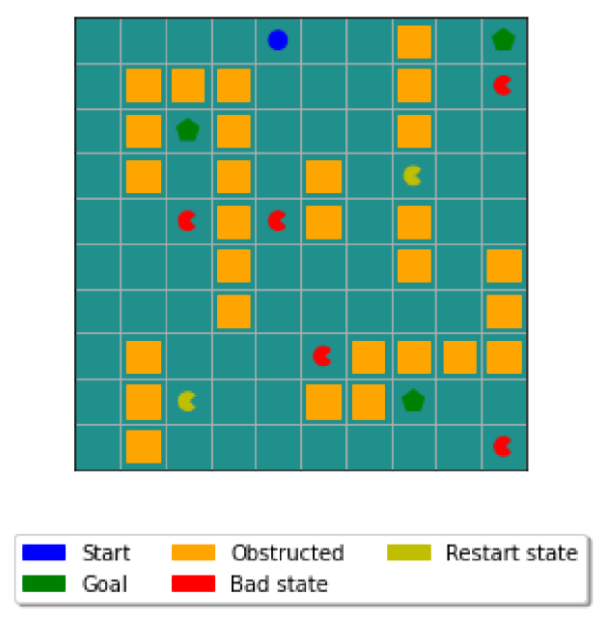
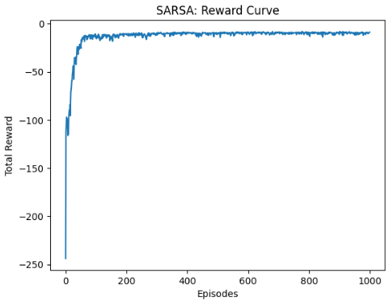
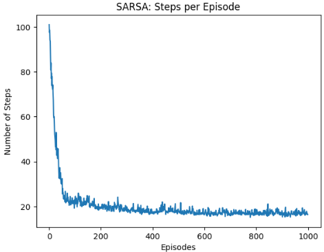
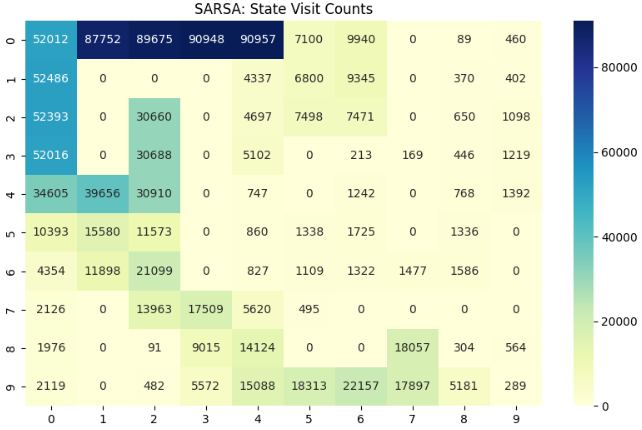
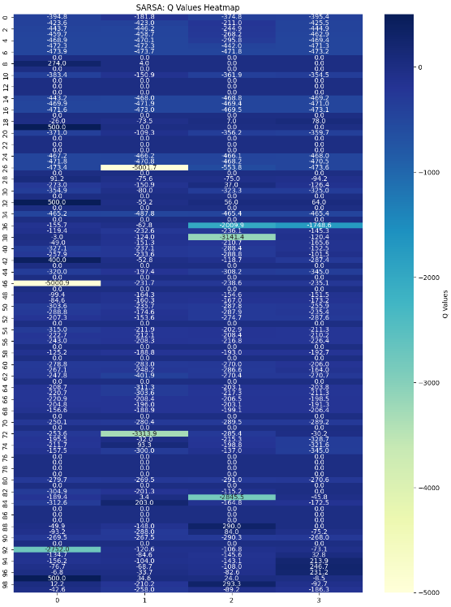

# Reinforcement Learning with SARSA and Q-Learning

## About
This repository contains implementations of SARSA and Q-Learning algorithms for a grid-based reinforcement learning task. The project explores various configurations and hyperparameters to optimize agent performance in different environmental settings.

## Project Overview
1. Implement SARSA and Q-Learning algorithms
2. Conduct experiments with 16 different configurations
3. Optimize hyperparameters for each configuration
4. Analyze and visualize results

## Configurations
The project explores 16 different configurations:
* SARSA (8 configurations):
    * p = 1.0
    * wind: True/False
    * start states: (0, 4) or (3, 6)
    * exploration strategies: ε-greedy or softmax
* Q-Learning (8 configurations):
    * p = 1.0 or 0.7
    * wind = False
    * start states: (0, 4) or (3, 6)
    * exploration strategies: ε-greedy or softmax

## Hyperparameter Optimization
For each configuration, the following hyperparameters are optimized:
* Learning rate (α): [0.001, 0.01, 0.1, 1.0]
* Discount factor (γ): [0.7, 0.8, 0.9, 1.0]
* ε-greedy exploration: [0.001, 0.01, 0.05, 0.1]
* Softmax temperature (τ): [0.01, 0.1, 1, 2]

## Visualizations
The project includes the following visualizations for each configuration:
* Reward curves and steps to goal per episode
* Heatmap of state visit counts
* Heatmap of Q-values and optimal actions

## Key Findings
* Optimal hyperparameters vary across configurations
* Wind and stochasticity significantly impact agent behavior
* Exploration strategies play a crucial role in performance

## Conclusion
* The optimal path which contains path towards the 3rd Goal State (8,7) results in the least amount of fluctuations in both reward and steps curve
* Wind causes the agent to shift its path towards the states in the right if there are no obstructed states
* Stochasticity = 0.7 results in the Agent exploiting too soon and not finding a strong enough path towards the goal state
